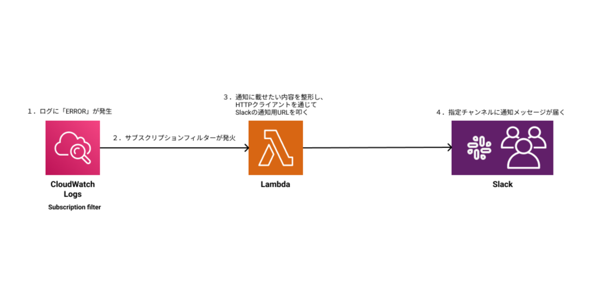

# CloudWatch Logs → Slack Real-Time Notifier (1 error = 1 notification)

## 🎯 What this template does
CloudWatch Logs の **サブスクリプションフィルター** を使い、  
対象ログに “ERROR” が1行出るごとに、**数秒以内に Slack へ 1 件通知**します。

- 即時性：1〜3秒  
- 1ログ = 1通知  
- Slack Workflow に対応  

## 🏗 Architecture


## 🚀 Use Cases
- APIエラーを1件ずつ即通知したい（遅延・集約を避けたい）  
- 本番環境で「誰がログインしたか」をリアルタイムに把握したい 
- バッチ処理の成功/失敗をリアルタイムに把握したい  

## ⚙ Setup Steps
1. Lambdaデプロイ  
2. Slack Webhook作成  
3. CloudWatch Logs → Subscription Filter を設定  
4. テストログを投入し、Slackに通知されることを確認  

## 📢 Specific example of log
以下のログが CloudWatch に出たとき：
```
ERROR: {'statusCode': 500, 'headers': {...}, 'body': '{...}'}
```
Slack には次のように通知される：
```
@channel 📢 ＜システムA＞ でエラーが発生しました！
エラー対応方法概要はコチラ: ＜マニュアルのURL＞
下記ログのURL: ＜CloudWatchログ＞
ERROR: {'statusCode': 500, 'headers': {...}, 'body': '{...}'}
↓リアクションしてください！（確認開始: 👀, 対応完了: ✅）
```

## 🔧 Lambda (Source + responsibilities)
- SNS 不要: 直接 Slack へ HTTP POST  
- CloudWatch Logs イベントを base64 + gzip → 復号 → JSON展開  
- ログ本文・CloudWatchログURL・対象サービス名を抽出し、Slackへ送信  
- 複数行ログは `MAX_LINES` まで出力  
- マルチ環境（複数PATH_{n}）に対応可能  

🔗 **Source:**  
https://github.com/amomo0220/aws-automation-templates/blob/main/cloudwatch-to-slack-notifier/Lambda/lambda_handler.py


### 🔧 Environment Variables
| Key | Value |
|-----|-------|
| HOOK_URL_{n} | Slack Webhook URL |
| PATH_{n} | 検知対象サービスのパス |
| PROJECT_NAME_{n} | 対象システム名 |
| MAX_LINES | Slackへ出力する最大行数 |

例：
```
HOOK_URL_1=https://hooks.slack...
MAX_LINES=3
PATH_1=/prod/items
PROJECT_NAME_1=ServiceA
```

### 🧪 Testing
`examples/` に CloudWatch Logs → Lambda と同じ形式の `sample_event.json` を同梱しています。

## 📝 Subscription Filter Examples
```
?ERROR ?error
```
※ログ形式に応じて変更可能

## 💡 Design Notes (Why Subscription Filter?)
- メトリクスフィルターは「**件数カウント→閾値超え**」の仕組みのため  
  - リアルタイム性が出ない  
  - 1エラー = 1通知 ができない  
- Subscription Filter の方が  
  - 即時性（1〜3秒）  
  - ログ個別処理  
  - 通知整形  
  に向いている  

⚠ 注意：Subscription Filter は **1ロググループにつき最大2件** まで。

## 💰 Cost (月額費用目安)
Lambda は無料枠でほぼ収まり、  
標準的な中規模システムの場合、**月額 数円〜数十円 程度**です。

## 🔧 Slack Workflow (optional)
- Slack で Webhook を作成  
- 変数例：`text`, `log_url`, `project_name`  
- 投稿テンプレ例：
```
@channel 📢 {}project_name でエラーが発生しました！
エラー対応方法概要はコチラ: ＜マニュアルのURL＞
下記ログのURL: {}log_url
{}text
↓リアクションしてください！（確認開始: 👀, 対応完了: ✅）
```

## ❗ Known Pitfalls
- `The log group provided is reserved for the function logs of the destination function.`  
  → Lambda自身のログには紐づけ不可。別の通知用Lambdaを使用すること。  
- 監視対象のログのフォーマットによっては、もっと通知内容の自由度が上がる  

## 📚 FAQ
### ユーザー視点
- 「こういう通知を出したい」  
  → CloudWatch ログ形式・検知ワードを確認しながら設計・提案可能
- 「通知の文面を変えたい」  
  → Slack Workflow／Lambda の整形部で変更可能  

### エンジニア視点
- 「通知が2回出る」  
  → ログ側で2行出ている可能性が高い  
- 「サブスクリプションフィルターではなく、メトリクスフィルターではダメ？」  
  → メトリクスフィルターの場合、集約しての通知になってしまう。リアルタイム用途には不向き  
  → ダッシュボード用途なら併用は有効  

## 📝 License
本プロジェクトは [MIT License](LICENSE) のもとで公開されています。  
Created by amomo0220
