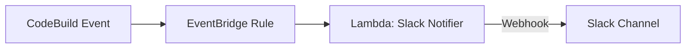

# codebuild-slack-notifier | AWS CodeBuild → Slack 通知テンプレート（SAM / Lambda）

## 🎯 What this template does
CodeBuild のビルド結果を **Slack に即時通知** するための最小構成テンプレートです。  
**最小権限・シンプル構成・SAM 一発デプロイ** にこだわって作られています。

## ✨ Features
- Slack Webhook URL は **SSM Parameter Store に安全に格納**
- EventBridge → Lambda → Slack の直列構成
- 例外ハンドリング・エラーログ強化済み
- SUCCEEDED / FAILED のステータスに応じて ✨絵文字つき通知✨

---

## 🔧 Requirements

* AWS CLI v2
* AWS SAM CLI
* IAM User or Role with CloudFormation/Lambda/SSM 権限
* Slack Webhook URL（Incoming Webhook）

---

## 🏗 Architecture



---

## 📦 Directory Structure

```
.
├── infra/
│   ├── template.yaml        # SAM/CloudFormation テンプレート
│   └── samconfig.toml       # (オプション) デプロイ設定
└── src/
    └── slack_notifier/
        ├── app.py           # Lambda 本体
        └── requirements.txt # 依存パッケージ（空でも可）
```

---

## 🔐 Prerequisites (SSM Setup)

```bash
aws ssm put-parameter \
  --name "/abcde/codepipeline/slack_webhook" \
  --value "https://hooks.slack.com/services/XXXX/XXXX/XXXX" \
  --type SecureString \
  --overwrite
```

---

## 🚀 Deploy (SAM)

### 1. Build

```bash
sam build
```

### 2. Deploy

```bash
sam deploy --guided
```

---

## 📩 Slack Message Examples

### SUCCEEDED

```
✅ [CodeBuild] Project: my-project / Status: SUCCEEDED
```

### FAILED

```
🔥 [CodeBuild] Project: my-project / Status: FAILED
```

---

## 📝 Processing Flow (app.py)

1. SSM から Webhook URL を取得
2. CodeBuild イベントから `project-name` と `build-status` を抽出
3. ステータスごとに絵文字付きメッセージ生成
4. Slack Webhook に POST
5. HTTP エラーや形式不正は Lambda を失敗させ、CloudWatch に詳細ログを出力

---

## 🛡 Minimum IAM Permissions

```yaml
- AWSLambdaBasicExecutionRole
- Effect: Allow
  Action:
    - ssm:GetParameter
  Resource: arn:aws:ssm:<region>:<account-id>:parameter/abcde/codepipeline/slack_webhook
```

---

## 🧪 Testing

Slack にメッセージが届くことを確認してください。

### SUCCEEDED

```json
{
  "detail-type": "CodeBuild Build State Change",
  "detail": {
    "project-name": "sample-project",
    "build-status": "SUCCEEDED",
    "additional-information": {
      "logs": {
        "deep-link": "https://console.aws.amazon.com/codebuild/home"
      }
    }
  }
}
```

### FAILED

```json
{
  "detail-type": "CodeBuild Build State Change",
  "detail": {
    "project-name": "sample-project",
    "build-status": "FAILED",
    "additional-information": {
      "logs": {
        "deep-link": "https://console.aws.amazon.com/codebuild/home"
      }
    }
  }
}
```

---

## ❗ Known Issues / Troubleshooting

### ❌ Slack HTTP 400 / 404

Webhook URL が壊れている可能性
→ SSM の値を再確認する

### ❌ Event 形式不正

CodeBuild イベントではない場合に発生
→ logger.warning の出力を確認する

---

## 📝 License
本プロジェクトは [MIT License](LICENSE) のもとで公開されています。  
Created by amomo0220
